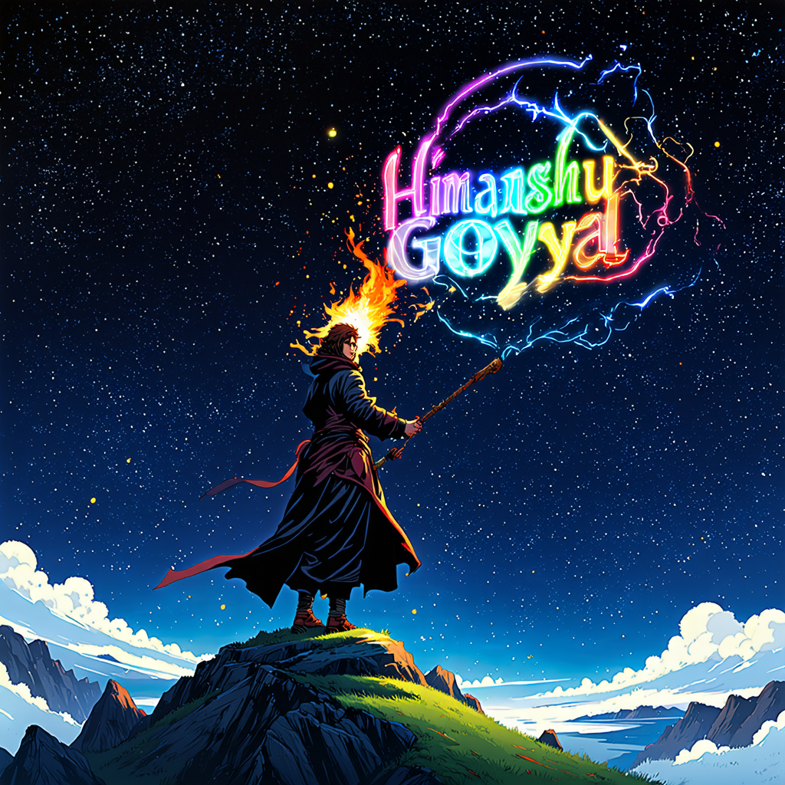
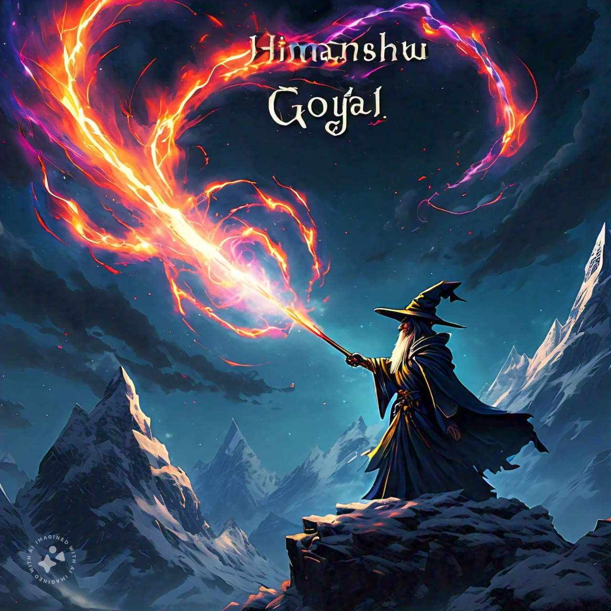

# Stable Diffusion 3 (SD3) Training

## Overview

This repository contains the code for training Stable Diffusion 3 (SD3) model using the ComfyUI interface and the TotoroUI patcher.

## Requirements

* Python 3.8+
* PyTorch 1.12+
* TorchSDE, Einops, Diffusers, Accelerate, and Xformers libraries
* aria2 for downloading model weights

## Installation

1. Clone this repository: `git clone -b totoro2 https://github.com/camenduru/ComfyUI /content/TotoroUI`
2. Install required libraries: `pip install -q torchsde einops diffusers accelerate xformers==0.0.26.post1`
3. Install aria2: `apt -y install -qq aria2`

## Model Weights

Download the pre-trained SD3 model weights using aria2:
```bash
aria2c --console-log-level=error -c -x 16 -s 16 -k 1M https://huggingface.co/adamo1139/stable-diffusion-3-medium-ungated/resolve/main/sd3_medium_incl_clips_t5xxlfp8.safetensors -d /content/TotoroUI/model -o sd3_medium_incl_clips_t5xxlfp8.safetensors
```

## Configuration


* Model patcher: `model_patcher`
* Clip model: `clip`
* VAE model: `vae`
* Clip vision model: `clipvision`
* Sampler: `dpmpp_2m`
* Scheduler: `sgm_uniform`
* Steps: `28`
* CFG: `4.5`

## Training


The model is trained using the `nodes.common_ksampler` function with the specified configuration.


## Code
-----
```python
import torch
import random
import node_helpers
from totoro.sd import load_checkpoint_guess_config
import nodes
import numpy as np
from PIL import Image

def zero_out(conditioning):
    c = []
    for t in conditioning:
        d = t[1].copy()
        if "pooled_output" in d:
            d["pooled_output"] = torch.zeros_like(d["pooled_output"])
        n = [torch.zeros_like(t[0]), d]
        c.append(n)
    return (c, )

prompt = input("Please enter your prompt: ")

with torch.inference_mode():
    latent = {"samples": torch.ones([1, 16, 1024 // 8, 1024 // 8]) * 0.0609}
    cond, pooled = clip.encode_from_tokens(clip.tokenize(prompt), return_pooled=True)
    cond = [[cond, {"pooled_output": pooled}]]
    negative_prompt = "bad quality, poor quality, doll, disfigured, jpg, toy, bad anatomy, missing limbs, missing fingers, 3d, cgi"
    n_cond, n_pooled = clip.encode_from_tokens(clip.tokenize(negative_prompt), return_pooled=True)
    n_cond = [[n_cond, {"pooled_output": n_pooled}]]

    n_cond1 = node_helpers.conditioning_set_values(n_cond, {"start_percent": 0, "end_percent": 0.1})
    n_cond2 = zero_out(n_cond)
    n_cond2 = node_helpers.conditioning_set_values(n_cond2[0], {"start_percent": 0.1, "end_percent": 1.0})
    n_cond = n_cond1 + n_cond2

    seed = 1
    if seed == 0:
        seed = random.randint(0, 18446744073709551615)
    print(seed)
    sample = nodes.common_ksampler(model=model_patcher,
                            seed=seed,
                            steps=28,
                            cfg=4.5,
                            sampler_name="dpmpp_2m",
                            scheduler="sgm_uniform",
                            positive=cond,
                            negative=n_cond,
                            latent=latent,
                            denoise=1)
    sample = sample[0]["samples"].to(torch.float16)
    vae.first_stage_model.cuda()
    decoded = vae.decode_tiled(sample).detach()

Image.fromarray(np.array(decoded*255, dtype=np.uint8)[0])
```
## Evaluation
Prompt=  generate an Epic anime artwork of a wizard atop a mountain at night casting a cosmic spell into the dark sky that says "Himanshu Goyal" made out of colorful energy


SD 3 predicted image



Meta AI predicted image

